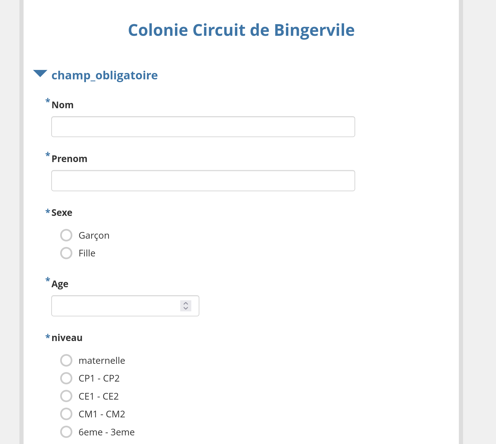
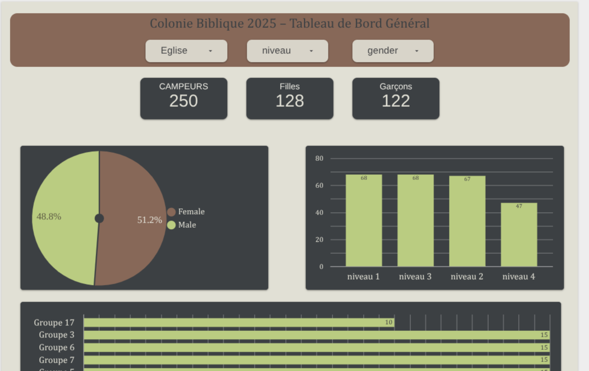

#  Gestion des inscriptions et suivi d'une colonie de vacances

## Objectif
Mettre en place un système numérique complet pour collecter, centraliser et visualiser les données d'inscription des campeurs.

---

##  Contexte
Avant ce projet, les inscriptions étaient réalisées manuellement sur papier, ce qui générait des erreurs et ralentissait l'organisation.

---

## 🛠️ Technologies utilisées
- [KoboToolbox](https://www.kobotoolbox.org/) pour la collecte des données
- [Google Looker Studio](https://lookerstudio.google.com/) pour la visualisation interactive
- Google Sheets pour la centralisation

---

##  Résultats
- Réduction du temps de saisie de 50%  
- Visualisation des données en temps réel  
- Meilleure fiabilité et accès partagé

---

## 🔗 Liens
- 🌐 [Formulaire KoboToolbox](https://ee.kobotoolbox.org/x/8fort8cA)
- 📊 [Dashboard Looker Studio](https://lookerstudio.google.com/reporting/78e4dbfe-1ee5-4dc0-8d80-fd33e0355545)
- 📄 [Rapport complet](./docs/rapport_complet.pdf)

---

##  Aperçu

### Formulaire

### Dashboard

---

## Enseignements
- Structurer un flux de données de la collecte à la visualisation
- Former des utilisateurs non techniques à un outil numérique
- Adapter la présentation des données aux besoins opérationnels
